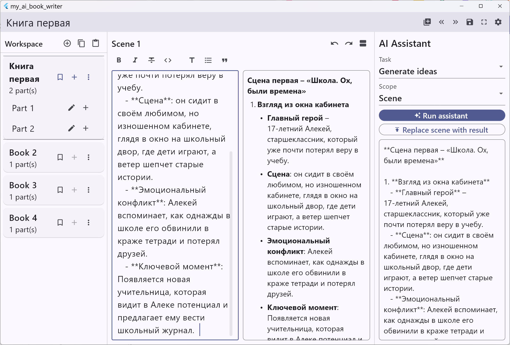

# My AI Book Writer

Desktop-first, open-source fiction writing app with continuous AI assistance.



## Why Flutter + Dart

The project uses `Flutter` on the stable channel with bundled `Dart` because it provides:

- one codebase for `Windows`, `macOS`, and `Android`
- mature rendering and tooling for desktop and tablet UX
- strong test support (`flutter_test`, widget tests, static analysis)
- maintainable long-term architecture with a predictable release process

## Current Scope

This repository currently includes a production-oriented foundation:

- adaptive shell (`desktop-first`, `tablet-second`)
- hierarchical workspace model (`Book -> Part -> Chapter -> Scene`)
- Markdown scene editor with split preview and focus mode
- scene-level change history (`undo` / `redo`)
- local autosave and crash-recovery snapshots
- AI provider abstraction for:
  - `Ollama` (local)
  - `OpenAI`
  - `Google Gemini`
  - `Perplexity`
  - `OpenRouter`
- local assistant settings + API key alias storage
- import/export service contracts with implemented text flows:
  - import: `TXT`, `Markdown`
  - export: `Markdown`, `HTML`, `DOCX`

`PDF` and `EPUB` export adapters are scaffolded by interface but not implemented in this build.

## Export DOCX and Workspace Files Location

### Export active book to DOCX from UI

- In the top app toolbar click `Export active book as DOCX` (download icon),
  or open `Settings` → `Current book` → `Export active book as DOCX...`.
- Confirm or edit the output path in the dialog and click `Export DOCX`.
- The app generates a `.docx` file for the active book content.

### Find where workspace files are stored

- In the top app toolbar click `Workspace files location` (folder icon),
  or open `Settings` → `Current book` → `Export and workspace`.
- The dialog/section shows the exact workspace directory path and provides
  `Copy workspace path` for quick access.
- The workspace directory contains at least:
  - `workspace.json` (main persisted workspace)
  - `recovery_snapshot.json` (autosave recovery snapshot)

Default workspace root is:

- `${ApplicationSupportDirectory}/my_ai_book_writer`

## Project Structure

```text
lib/
  core/
    models/      # domain models and assistant settings models
    services/    # app controller, AI orchestration, change history
    storage/     # local workspace/settings persistence
  features/
    workspace/   # adaptive shell and hierarchy navigation
    settings/    # AI provider settings dialog
    import_export/
test/
  core/          # unit tests
  features/      # import/export tests
  widget_test.dart
```

## Prerequisites

- `Flutter 3.41+` on stable channel
- Dart comes bundled with Flutter
- Platform toolchains:
  - `Android Studio` + Android SDK (Android)
  - `Visual Studio Build Tools` with C++ Desktop workload (Windows)
  - `Xcode` (macOS builds, on macOS host)

Validate environment:

```powershell
flutter --version
flutter doctor -v
```

## Run Locally

Install dependencies:

```powershell
flutter pub get
```

Run on a connected/default target:

```powershell
flutter run
```

Run on a specific platform:

```powershell
flutter run -d windows
flutter run -d android
flutter run -d macos
```

## Quality Checks

```powershell
flutter analyze
flutter test
```

## Build Artifacts

Examples:

```powershell
flutter build windows
flutter build apk --release
flutter build macos
```

For release automation details, see `docs/build_and_release.md`.

## Privacy and Offline Behavior

- Workspace data is stored locally on the user device.
- API keys are stored locally using app preferences.
- No developer-owned backend is used.
- With Ollama configured, assistant flows can run fully offline.

## License

This project is intended to be fully open-source and free to use.
